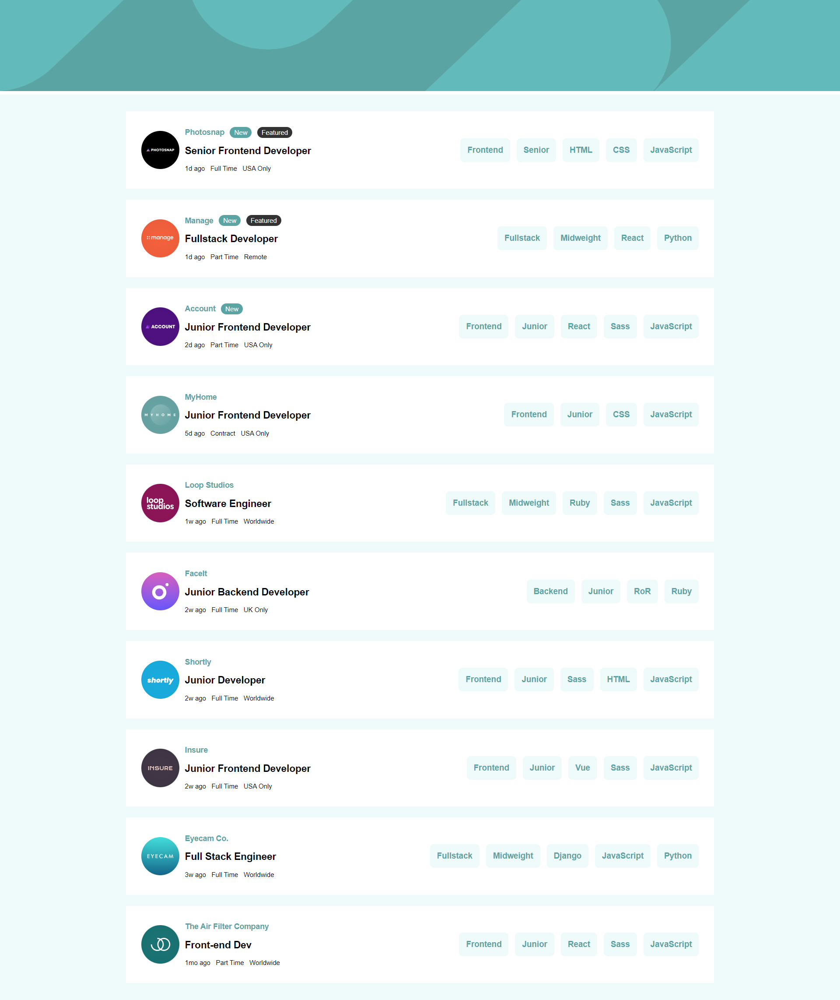

# Frontend Mentor - Job listings with filtering solution

This is a solution to the [Job listings with filtering challenge on Frontend Mentor](https://www.frontendmentor.io/challenges/job-listings-with-filtering-ivstIPCt). Frontend Mentor challenges help you improve your coding skills by building realistic projects. 

## Table of contents

- [Overview](#overview)
  - [The challenge](#the-challenge)
  - [Screenshot](#screenshot)
  - [Links](#links)
- [My process](#my-process)
  - [Built with](#built-with)
  - [What I learned](#what-i-learned)
  - [Continued development](#continued-development)
  - [Useful resources](#useful-resources)
- [Author](#author)
- [Acknowledgments](#acknowledgments)

## Overview

The job listing page is a responsive web application built using React, HTML, and CSS. It showcases a collection of job listings using demo data, providing users with a simulated experience of browsing and searching for job opportunities.

The page is designed to be visually appealing and user-friendly, with a clean and intuitive layout. Each job listing is presented with key details such as job title, company name, location, and application deadline. Users can easily navigate through the job listings and explore different options.

Although the page utilizes demo data instead of integrating with real-time job listing APIs, the development process still allowed me to gain valuable experience in structuring and presenting information effectively. I focused on creating a smooth user interface and implementing features like filtering and sorting to enhance the browsing experience within the limitations of the demo data.

By building this job listing page, I learned the importance of designing intuitive user interfaces, organizing data in a meaningful way, and providing users with tools to refine their search. These skills can be further applied to future projects that involve integrating with real APIs and delivering dynamic and personalized content to users.

### The challenge

Users should be able to:

- View the optimal layout for the site depending on their device's screen size
- See hover states for all interactive elements on the page
- Filter job listings based on the categories

### Screenshot

### Links

- Solution URL: [Solution Repository](https://github.com/wolfgunblood/jobit)
- Live Site URL: [Live Demo](https://wolfgunblood.github.io/jobit/)

## My process

### Built with

- Semantic HTML5 markup
- CSS custom properties
- Flexbox
- CSS Grid
- Mobile-first workflow
- [React](https://reactjs.org/) - JS library

### What I learned

- Understanding and implementing responsive web design principles.
- Creating clean and visually appealing user interfaces using HTML and CSS.
- Structuring and presenting information effectively for better user experience.
- Implementing filtering and sorting functionality to enhance data browsing.
- Working with demo data to simulate real-world scenarios.
- Gaining experience in handling and displaying dynamic content.
- Improving skills in data organization and presentation.
- Developing an understanding of user needs and preferences in job search platforms.
- Enhancing knowledge of React components and state management.
- Exploring techniques for data manipulation and rendering in a web application.

## Author

- Website - [Jalaj Doraiburu](https://wolfgunblood.github.io/portfolio/)
- Frontend Mentor - [@wolfgunblood](https://www.frontendmentor.io/profile/wolfgunblood)
- Twitter - [@jalaj_dorai](https://twitter.com/jalaj_dorai)

## Acknowledgments

I would like to express our gratitude to Frontend Mentor (https://www.frontendmentor.io) for providing the design and inspiration for this project. Frontend Mentor offers a vast collection of design challenges and projects that allow developers to enhance their skills by building real-world applications.
